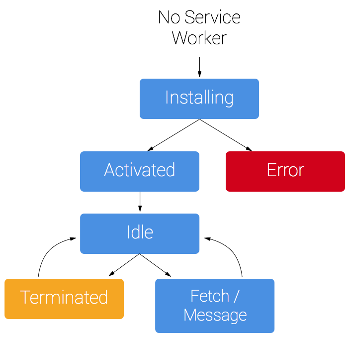
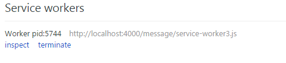

# Service worker

## Service Worker初体验

    service worker是一段脚本，与web worker一样，也是在后台运行。
    作为一个独立的线程，运行环境与普通脚本不同，所以不能直接参与web交互行为。
    native app可以做到离线使用、消息推送、后台自动更新，service worker的出现是正是为了使得web app也可以具有类似的能力。

### service worker 可以:

* 后台消息传递
* 网络代理、转发请求、伪造响应
* 离线缓存
* 消息推送
* ...

> 本文以资源缓存为例，说明一下service worker是如何工作的。

### **生命周期**

先看一下service worker的运行周期


上图是service worker的生命周期，请参考[出处](http://www.html5rocks.com/en/tutorials/service-worker/introduction/)。

图中可以看到，一个service worker要经历一下过程：

1. 安装
2. 激活，激活成功后，打开chrome"//inspect/#service-workers可以查看到当前运行的service worker

3. 监听fetch和message事件，下面两种事件会进行简要描述
4. 销毁，是否销毁由浏览器决定，如果一个service worker长期不使用或者机器内存有限，则可能会销毁这个worker

#### *Fetch*事件
> 在页面发起http请求时，service worker可以通过fetch事件拦截请求，并且给出自己的响应。

w3c提供了一个新的fetch api，用于取代XMLHttpRequest，与XMLHttpRequest最大不同有两点:

1. fetch()方法返回的是Promise对象，通过then方法进行连续调用，减少嵌套。ES6的Promise在成为标准之后，会越来越方便开发人员。
2. 提供了Request、Response对象。前端要发起请求可以通过url发起，也可以使用Request对象发起，而且Request可以复用。但是Response在哪里呢？在service worker出现之前，前端确实不会自己给自己发消息，但是有了service worker，就可以在拦截请求之后根据需要返回自己的相应，对页面而言，这个普通的请求结果并没有区别，这是Reponse的一处应用。

下面是一个用fetch api通过fliker的公开api获取图片的例子:

```javascript
/* 由于是get请求，直接把参数作为query string传递了 */
var URL = 'https://api.flickr.com/services/rest/?method=flickr.photos.search&api_key=your_api_key&format=json&nojsoncallback=1&tags=penguins';
 
function fetchDemo() {
  // fetch(url, option)支持两个参数，option中可以设置header、body、method信息
  fetch(URL).then(function(response) {
    // 通过promise 对象获得相应内容，并且将响应内容按照json格式转成对象，json()方法调用之后返回的依然是promise对象
    // 也可以把内容转化成arraybuffer、blob对象
    return response.json();
  }).then(function(json) {
    // 渲染页面
    insertPhotos(json);
  });
}
 
fetchDemo();
```
fetch api相比XMLHttpRequest更加简洁，并且提供的功能更全面，资源获取方式比ajax更优雅。兼容性方面：chrome 42开始支持，对于旧浏览器，可以通过官方维护的polyfill支持。

#### *message事件*

页面和serviceWorker之间可以通过postMessage()方法发送消息，发送的消息可以通过message事件接收到。

这是一个双向的过程，页面可以发消息给service worker，service worker也可以发送消息给页面，由于这个特性，可以将service worker作为中间纽带，使得一个域名或者子域名下的多个页面可以自由通信。
> 这里是一个小的页面之间通信[demo](https://nzv3tos3n.qnssl.com/message/msg-demo.html)


#### *service worker*缓存文件
> 下面介绍一个利用service worker缓存离线文件的例子

	准备index.js, 用于注册service-worker

```javascript
if (navigator.serviceWorker) {
	navigator.serviceWorker.register('service-worker.js').then(function(registration) {
		console.log('service worker 注册成功');
	}).catch(function (err) {
		console.log('service worker 注册失败');
	});
}
```
在上述代码中，注册了service-worker作为当前路径下的service worker。由于service worker的权限很高，所有的代码都需要是安全可靠的所以只有https站点才可以使用service worker，当然localhost是一个特例。

注册完毕，现在开始写service-worker.js代码。

根据前面的声明周期图，在一个新的service worker被注册以后，首先会触发Install事件，在service-worker.js中，可以通过监听install事件进行一些初始化工作，或者什么也不做。

因为我们是要缓存离线文件，所以可以在install事件中开始缓存，但是只是将文件加到caches缓存中，真正想让浏览器使用缓存文件需要在fetch事件中拦截。

```javascript
var cacheFiles = ['about.js', 'blog.js'];
self.addEventListener('install', function (event) {
	event.waitUntil(
		caches.open('my-test-cache-v1')
			.then(function (cache) {
				return cache.addAll(cacheFiles);
			});
	);
})
```
首先定义了需要缓存的文件数组cacheFile，然后在install事件中缓存这些文件。

event是一个installEvent对象，继承自cacheFile，然后的waitUntil()方法接收一个Promise对象，直到这个Promise对象成功resolve之后，才会继续运行service-worker.js。

caches是一个CacheStorage对象，使用open()方法打开一个缓存，缓存通过名称进行分区。获得cache实例之后，调用addAll()方法缓存文件。

想让浏览器使用缓存，还需要拦截fetch事件

```javascript
// 缓存图片
self.addEventListener('fetch', function (event) {
	event.respondWith(
		caches.match(event.request).then(function (response) {
			if (response) {
				return response;
			}
			var request = event.request.clone();
			return fetch(request).then(function (response) {
				if (!response && response.status !== 200 && !response.headers.get('Content-Type').match(/image/)) {
					return response;
				}
				var responseClone = response.clone();
				caches.open('my-test-cache-v1').then(function (cache) {
					cache.put(event.request, responseClone);
				});
				return response;
			});
		})
	)
});
```
通过监听fetch事件，service worker可以返回自己的响应。

首先检查缓存中是否已经缓存了这个请求，如果有，就直接返回响应，就减少了一次网络请求。否则由service worker发起请求，这时的servie worker起到了一个中间代理的作用。

service worker请求的过程通过fetch api完成，得到response对象以后进行过滤，查看是否有图片文件，如果不是，就直接返回请求，不会缓存。

这就是service worker的强大之处：拦截请求，伪造响应。fetch api在这里起到了很大的作用。

service worker的更新很简单，只要service-worker.js的文件内容有更新，就会是用新脚本。但是有一点要注意：旧缓存文件的清除、新文件的缓存要在activate事件中进行，因为可能旧的页面还在使用之前的缓存文件，清除之后会失去作用。

*在初次使用service worker的过程中，也遇到了一些问题，下面是其中两个*

##### 问题1 运行时间

service worker并不是一直在后台运行的。在页面关闭后，浏览器可以继续保持service worker运行，也可以关闭service worker，这取决于浏览器自己的行为。所以不要定义一些全局变量，例如下面的代码

```javascript
var hitCounter = 0;
this.addEventListener('fetch', function (event) {
	hitCount++;
	event.responseWith(new Response('Hit Number ' + hitCounter));
});
```
	返回的结果可能是没有规律的1,2,2,3,1,2,1,1...，原因是hitCounter并没有一直存在，如果浏览器关闭了，下次启动的时候hitCounter就赋值为0了。
	这样的事情导致调试代码困难，当你更新一个service worker以后，只有在打开新页面以后才可能使用新的service worker，在调试过程中经常等一两分钟才会使用新的。

##### 问题2 权限太大
当service worker监听fetch事件以后，对应的请求都会经过service worker。通过chrome的network工具，可以看到类似请求会标注：from service worker。如果service worker中出现了问题，会导致所有请求失败，包括普通的Html文件。所以service worker的代码质量、容错性一定要很好才能保证web app正常运行。

[原文地址](http://www.alloyteam.com/2016/01/9274/)
* [Service Worker 入门](https://www.w3ctech.com/topic/866)
* [Service Worker API](https://developer.mozilla.org/zh-CN/docs/Web/API/Service_Worker_API)
